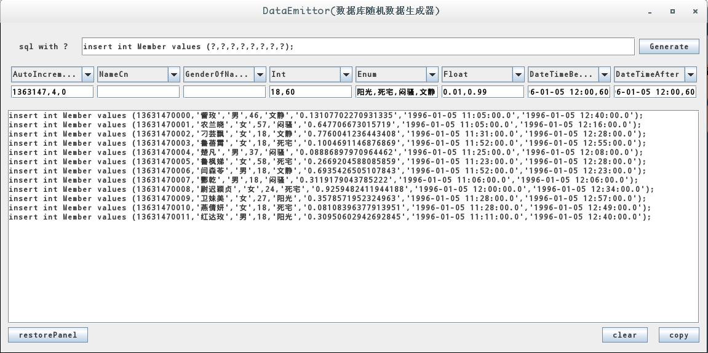

A simple java GUI tool to generate sql sentences quickly.

Usage:

every option of a combox can produce a data type of sql, like int, float, datetime, etc.
use the textField below the combox to limit the range of the generated data,for example, in the picture above, the textFiled of the Int combox is fill with "18,16", it means the generated Integer' range is from 18 to 60.

once with these sentences, then copy and paste on sql command line.